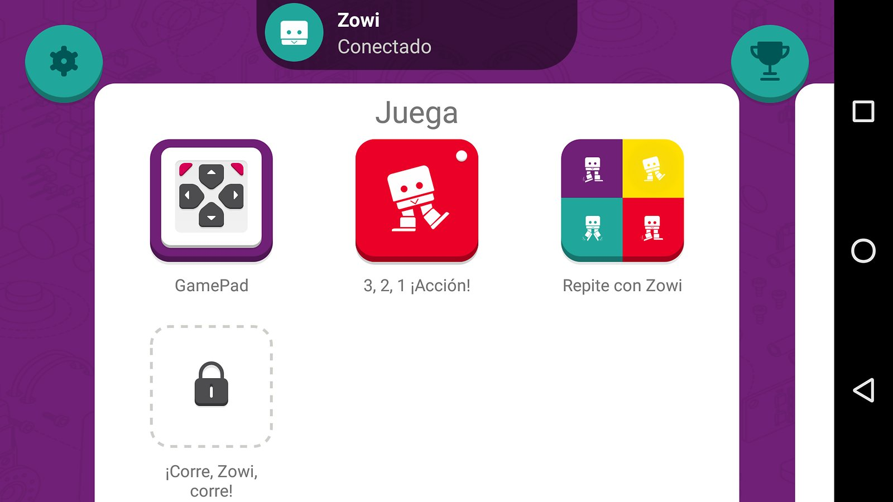
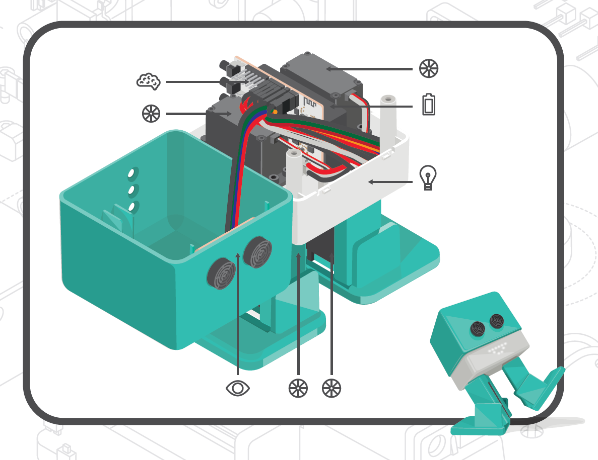
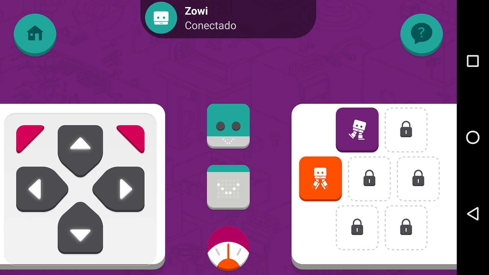
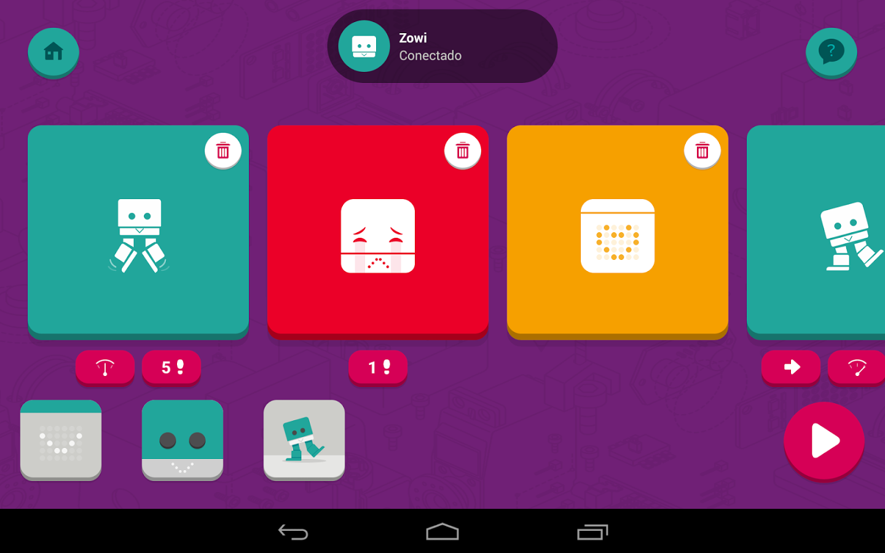

# Taller de Zowi

## CEIP Federico García Lorca

## 17 de Febrero de 2016

# ¡¡ Hola soy Zowi!!

# Zowi es un robot

# ¿Qué es un robot?

¿Hacemos una [encuesta](https://create.kahoot.it/?_ga=1.256153608.2056625729.1452556026&deviceId=365ec0cb-25a2-47f5-8862-2a26ec6fe460#survey/bc3cc91c-6a19-4b4b-8dd4-621a4950a337)?

¿Conoces Kahoot?

### "Máquina automática programable capaz de realizar determinadas operaciones de manera autónoma y sustituir a los seres humanos en algunas tareas, en especial las pesadas, repetitivas o peligrosas; puede estar dotada de sensores, que le permiten adaptarse a nuevas situaciones”

# Vamos a ver la ZowiApp

# ¿Qué hay dentro de Zowi?

* Placa controladora
* Batería
* Servomotores
* Sensor ultrasonidos
* Micrófono
* Zumbador
* Botones

* ¡¡ Y un programa !!

# Zowi es open-source

## Lo puedes [reprogramar](http://bitbloq.bq.com)

## Puedes cambiar su aspecto y Diseñar complementos

## Añadirle nuevos movimientos

[vídeo](https://twitter.com/BQAcademyES/status/695296147464806400)

## Algunos [ejemplos](https://github.com/bqlabs/zowi/tree/master/mods)

## Zowi es un robot, pero hay que tener cuidadarle:

### Cuida de que no se caiga de la mesa
### No intentes forzar sus movimientos
### Mímalo

## Vamos a jugar con Zowi!!

1. Baile
1. Esquiva-Obstáculos
1. Zowi oye

## Vamos a jugar con la aplicación

## Haz una secuencia

## Todo esto es lo que sabe hacer Zowi, pero podemos cambiar su programa
