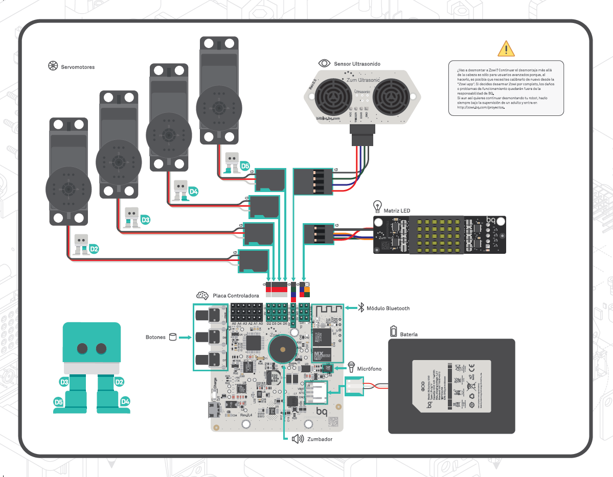

# Taller de Zowi

## CEIP Federico García Lorca

## 17 de Febrero de 2016

# ¡¡ Hola soy Zowi!!

# ¿Qué hay dentro de Zowi?

# Zowi es open-source

## Lo puedes reprogramar

## Puedes cambiar su aspecto

## Añadirle nuevos movimientos

## Diseñar complementos

## Algunos [ejemplos](https://github.com/bqlabs/zowi/tree/master/mods)

